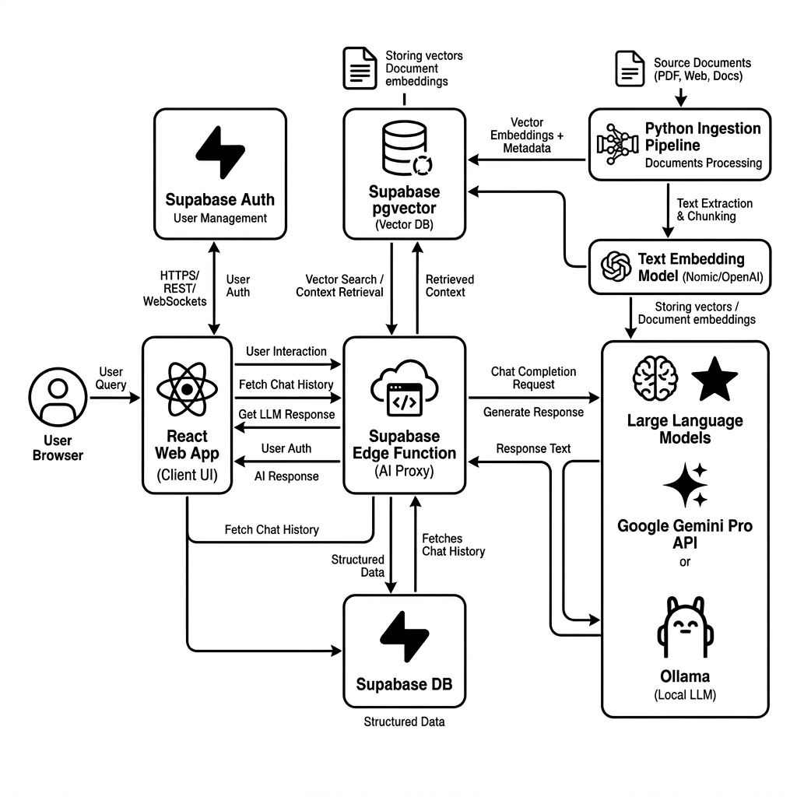
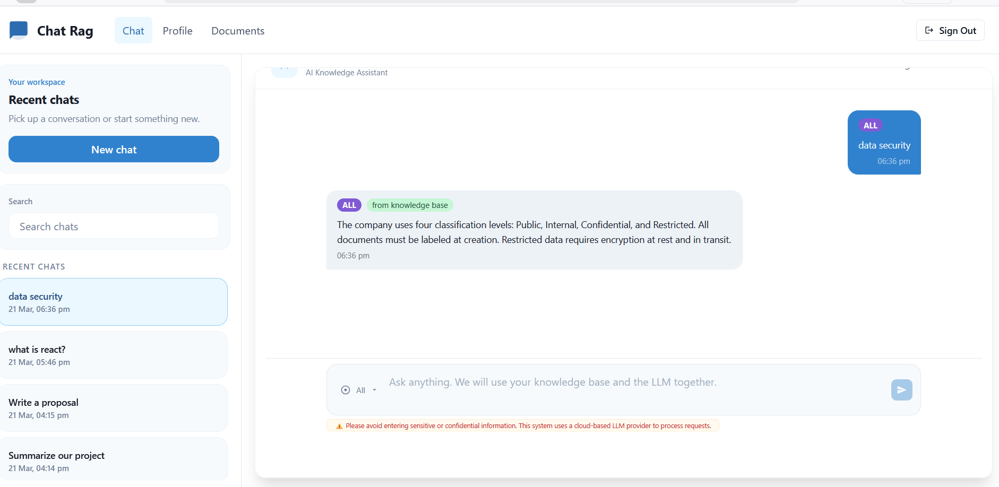

# Chat RAG Web

Bring your docs/data, ask a question, and let the app do the scavenger hunt.

This repository is a learn-by-building RAG(Retrieval-Augmented Generation) project centered on a dummy company knowledge base. It provides a chat experience for answering internal company questions as well as interacting directly with an LLM provider.

The stack includes a React web app, Supabase authentication and vector search, a Python-based embedding pipeline, and Supabase Edge Functions used as a proxy API to securely handle requests without exposing secrets in the client. It supports both cloud models through Gemini and local models through Ollama.

Instead of building a custom chat UI from scratch, you can also use existing open-source, free chat interfaces:

- [Open WebUI](https://openwebui.com/)
- [LibreChat](https://www.librechat.ai/)

> [!NOTE]
> **Performance & Hosting**: This project is optimized for the **Free Tiers** of Supabase and Google AI Studio. You may experience some latency due to the shared infrastructure. For enhanced performance and privacy, you can transition to **Enterprise tiers**, **On-Premise hosting**, or **Local models** via Ollama.

## What This Project Does

- Sign users in with Supabase OAuth.
- Save chat history in Postgres.
- Search embedded knowledge-base documents with `pgvector`.
- Answer with your knowledge base first, then fall back to the LLM when needed.

## How It Works (Architecture Flow)



1. **User/Browser**: A user signs in and interacts with the chat interface.
2. **React Web App**: Built with Vite + React, the frontend handles UI state and interacts with Supabase services.
3. **Supabase Auth & Database**: Manages secure user sessions and stores persistent chat histories in Postgres.
4. **Python Ingestion Pipeline**: Processes knowledge-base documents (chunking, embedding) and Upserts them into the Vector DB.
5. **Supabase Edge Function (AI Proxy)**: The secured "brain" of the project. It acts as an internal API, meaning:
   - **No Secrets in Client**: Sensitive API keys (like Gemini) are stored only as Supabase secrets, never exposed to the browser.
   - **Unified Logic**: One function handles vector search (`match_documents`), context grounding, and LLM orchestration.
   - **Simplified Frontend**: The React app focuses on the UI and history, making it perfect for rapid experimentation and small demo projects.
6. **LLM Providers**: Google Gemini (Cloud) or Ollama (Local) generate responses based on the grounded context provided by the Edge Function.

## Chat Modes

| Mode                    | Behavior                                                                                                                                |
| ----------------------- | --------------------------------------------------------------------------------------------------------------------------------------- |
| **All**                 | Checks embeddings first. If a strong match is found, it returns the answer directly. Otherwise, it uses the LLM with retrieved context. |
| **Only Knowledge Base** | Strictly uses internal training data from `pgvector`. No fallback to LLM if data is missing.                                            |
| **Only LLM Chat**       | Skips retrieval and interacts directly with the LLM provider for general purpose chat.                                                  |

## Project Structure

```text
chat-rag/
|-- README.md
`-- src/
    |-- Web/
    |   |-- src/                    # React + Vite app
    |   |-- public/documents/       # Sample knowledge-base files shown in the UI
    |   |-- README-INTEGRATION.md   # Web app setup
    |   |-- README-EMBEDDINGS.md    # Embeddings + RAG basics
    |   |-- README-SUPABASE.md      # Supabase + pgvector setup
    |   `-- README-PROVIDERS.md     # Cloud vs local vs public AI choices
    `-- EmbeddingPipeline/
        |-- main.py                 # Ingestion entry point
        |-- src/                    # Loaders, splitter, indexing, vector store
        `-- README.md               # Pipeline setup and usage
```

## Main App Pieces

| Area         | Main files/components                        | Job                                      |
| ------------ | -------------------------------------------- | ---------------------------------------- |
| Layout       | `AppShell`, `Header`, `Sidebar`              | App shell, navigation, recent chats      |
| Chat UI      | `ChatRagPage`, `ChatInput`, `ChatMessage`    | Ask questions and render answers         |
| Auth         | `AuthContext`, `OAuthButton`, `LandingPage`  | Sign in with Supabase OAuth              |
| Chat history | `ChatHistoryContext`, `repository.ts`        | Create, load, search, and delete chats   |
| AI Proxy     | `ai-proxy-chat-rag` (Supabase Edge Function) | Unified RAG, Grounding, and AI responses |
| Web Core     | `useChatRag.ts`, `ChatContext.tsx`           | Manage UI state and invoke the AI Proxy  |

## Components And Tools Used

| Layer              | Used here                                         |
| ------------------ | ------------------------------------------------- |
| Frontend           | React, TypeScript, Vite, Chakra UI, Framer Motion |
| Auth + data        | Supabase Auth, Supabase Postgres                  |
| Vector DB          | Postgres + `pgvector` via Supabase RPC            |
| LLM providers      | Gemini, Ollama                                    |
| Ingestion pipeline | Python, LangChain, Supabase vector store          |

## Choose Your Setup

| If you want...                 | Pick this                              | Repo support  | Read next                                        |
| ------------------------------ | -------------------------------------- | ------------- | ------------------------------------------------ |
| Fastest cloud demo             | Gemini + Supabase                      | Supported now | [Web integration](src/Web/README-INTEGRATION.md) |
| Local model inference          | Ollama + Supabase                      | Supported now | [Web integration](src/Web/README-INTEGRATION.md) |
| Embeddings and RAG basics      | Gemini pipeline + Supabase `documents` | Supported now | [Embeddings guide](src/Web/README-EMBEDDINGS.md) |
| Supabase schema and SQL setup  | Auth + chat history + `pgvector`       | Supported now | [Supabase guide](src/Web/README-SUPABASE.md)     |
| Privacy and provider tradeoffs | Cloud vs local vs public AI            | Guide only    | [Provider guide](src/Web/README-PROVIDERS.md)    |

## Quick Start

### Web app

```bash
cd src/Web
npm install
cp .env.example .env.local
npm start
```

### Embedding pipeline

```bash
cd src/EmbeddingPipeline
uv sync
cp .env.example .env
uv run main.py
```

Use the pipeline when you want to index or re-index documents into Supabase.

## Read More

- [Web integration and provider setup](src/Web/README-INTEGRATION.md)
- [Embeddings and RAG, explained simply](src/Web/README-EMBEDDINGS.md)
- [Supabase and pgvector setup](src/Web/README-SUPABASE.md)
- [Cloud, local, and public AI choices](src/Web/README-PROVIDERS.md)
- [Embedding pipeline guide](src/EmbeddingPipeline/README.md)

## Chat UI


